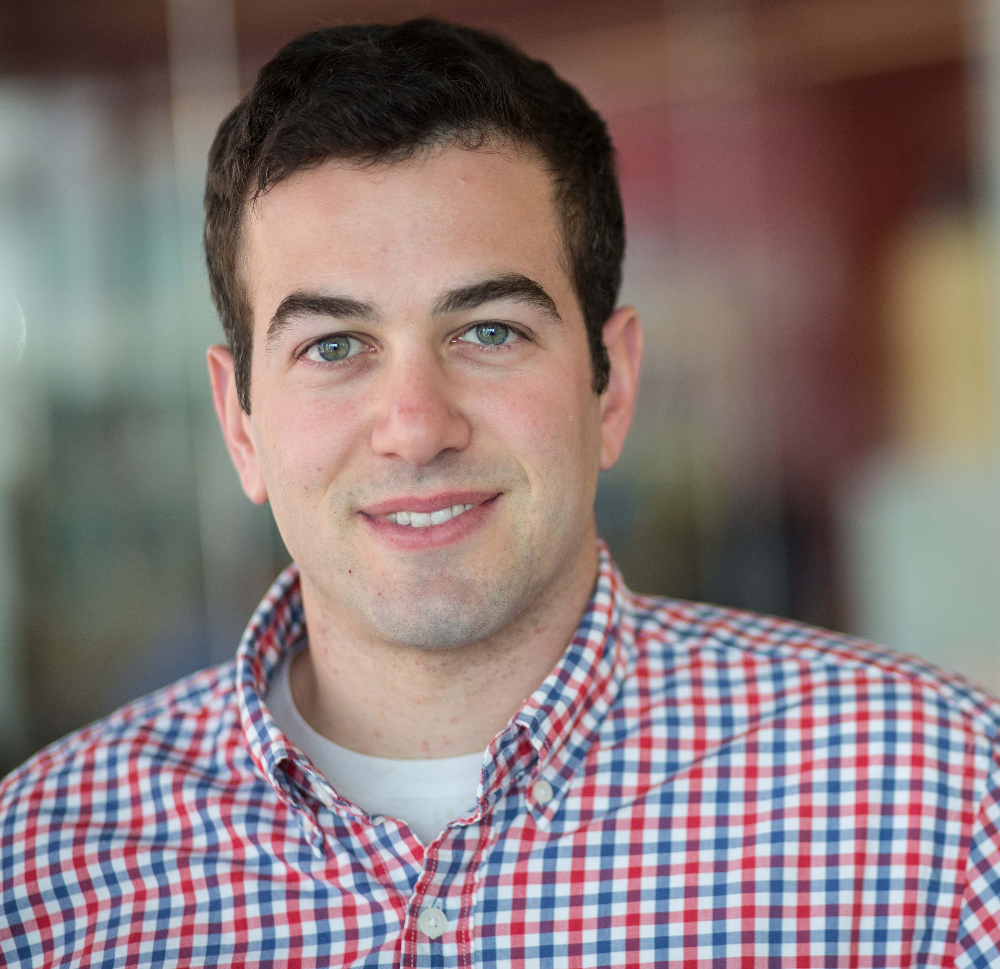
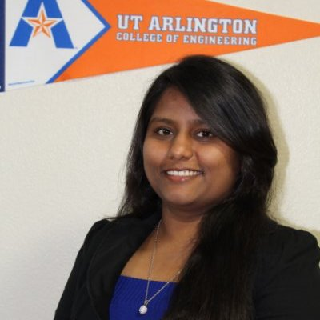
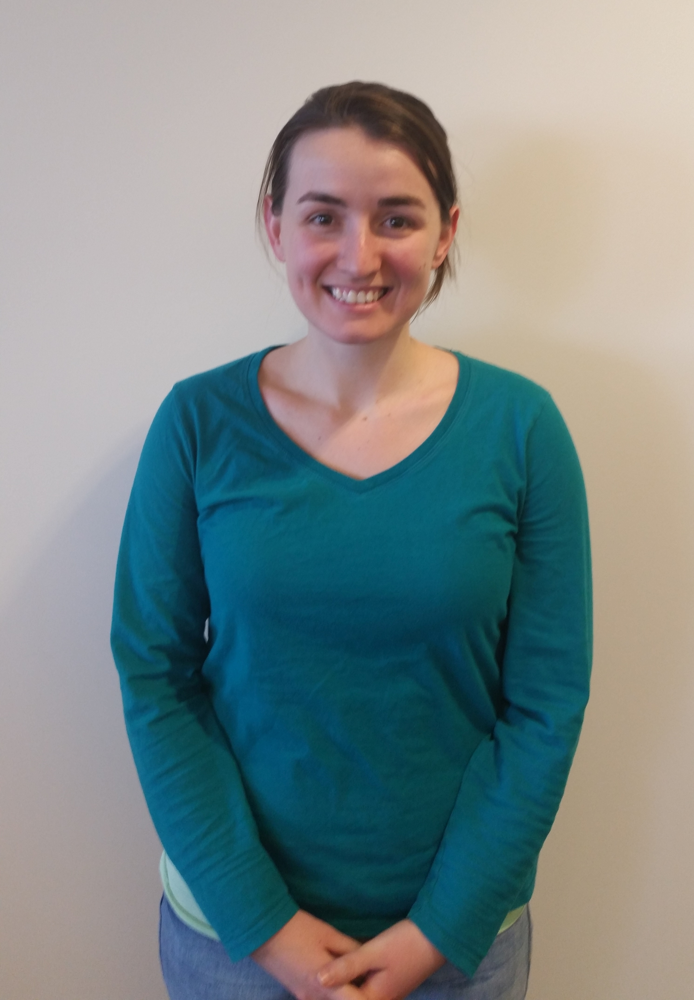
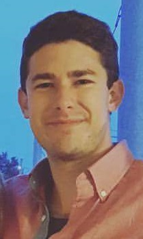
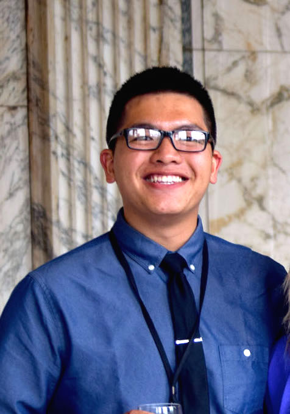
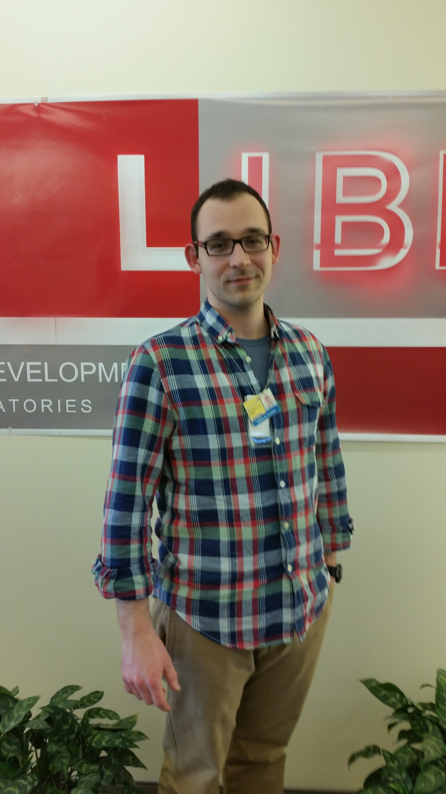
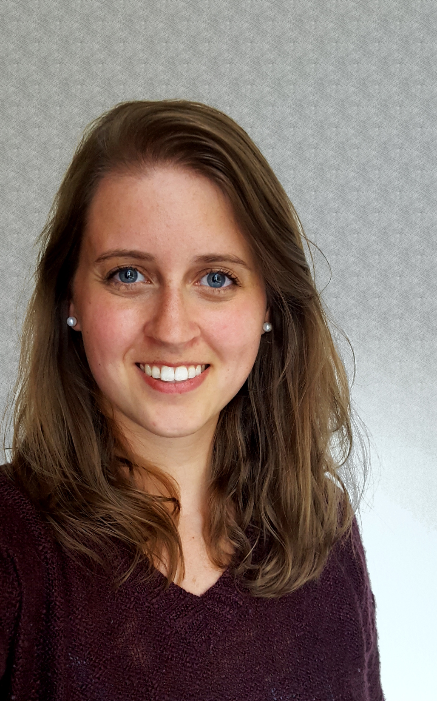



&nbsp;&nbsp;&nbsp;Andrew E. Jaffe, Ph.D. 
&nbsp;&nbsp;&nbsp;[Lead Investigator](http://libd.org/contact/staff-directory/27-andrew-jaffe) 
&nbsp;&nbsp;&nbsp;[Lieber Institute for Brain Development](http://www.libd.org) 
&nbsp;&nbsp;&nbsp;[Assistant Professor](http://www.jhsph.edu/faculty/directory/profile/5291/Jaffe/Andrew%20E.) 
&nbsp;&nbsp;&nbsp;[Department of Mental Health](http://www.jhsph.edu/departments/mental-health/) 
&nbsp;&nbsp;&nbsp;[Department of Biostatistics](http://www.jhsph.edu/departments/biostatistics/) 
&nbsp;&nbsp;&nbsp;[Johns Hopkins Bloomberg School of Public Health](www.jhsph.edu) 
 
&nbsp;&nbsp;&nbsp;[Contact](index.html) | [CV](files/jaffe-cv.pdf) 
  

&nbsp;&nbsp;&nbsp;Leonardo Collado-Torres, Ph.D.  
&nbsp;&nbsp;&nbsp;Data Scientist, Staff 
&nbsp;&nbsp;&nbsp;[Lieber Institute for Brain Development](http://www.libd.org) 
 
&nbsp;&nbsp;&nbsp;[Personal Webpage](http://www.biostat.jhsph.edu/~lcollado/#.VO-HmvnF98E) 
      

&nbsp;&nbsp;&nbsp;Madhavi Tippani 
&nbsp;&nbsp;&nbsp;Research Associate 
&nbsp;&nbsp;&nbsp;[Lieber Institute for Brain Development](http://www.libd.org) 
  

&nbsp;&nbsp;&nbsp;Nick Eagles 
&nbsp;&nbsp;&nbsp;Research Assistant 
&nbsp;&nbsp;&nbsp;[Lieber Institute for Brain Development](http://www.libd.org) 
  

&nbsp;&nbsp;&nbsp;Josh Stolz 
&nbsp;&nbsp;&nbsp;Research Associate 
&nbsp;&nbsp;&nbsp;[Lieber Institute for Brain Development](http://www.libd.org) 
  

## PhD Students

&nbsp;&nbsp;&nbsp;Matt Nguyen 
&nbsp;&nbsp;&nbsp;PhD Student 
&nbsp;&nbsp;&nbsp;Human Genetics Program 
&nbsp;&nbsp;&nbsp;[Institute of Genetic Medicine](http://igm.jhmi.edu/) 
  

&nbsp;&nbsp;&nbsp;Brianna Barry 
&nbsp;&nbsp;&nbsp;PhD Student 
&nbsp;&nbsp;&nbsp;BCMB Program 
&nbsp;&nbsp;&nbsp;[John Hopkins School of Medicine](http://igm.jhmi.edu/) 
&nbsp;&nbsp;&nbsp;Co-advisor: [Keri Martinowich](http://igm.jhmi.edu/) 
  

&nbsp;&nbsp;&nbsp;Kira Mandell 
&nbsp;&nbsp;&nbsp;PhD Student 
&nbsp;&nbsp;&nbsp;Human Genetics Program 
&nbsp;&nbsp;&nbsp;[Institute of Genetic Medicine](http://igm.jhmi.edu/) 
  

## Alumni

&nbsp;&nbsp;&nbsp;Amanda Price, Ph.D.  
&nbsp;&nbsp;&nbsp;AAAS Fellow 
&nbsp;&nbsp;&nbsp;NICHD 
      

&nbsp;&nbsp;&nbsp;Stephen Semick 
&nbsp;&nbsp;&nbsp;Medical Student 
&nbsp;&nbsp;&nbsp;University of Maryland 
      

&nbsp;&nbsp;&nbsp;Badoi Phan 
&nbsp;&nbsp;&nbsp;MD/PhD Student 
&nbsp;&nbsp;&nbsp;University of Pittsburgh/Carnegie Mellon University 
      

&nbsp;&nbsp;&nbsp;Nikolay Ivanov 
&nbsp;&nbsp;&nbsp;Medical Student 
&nbsp;&nbsp;&nbsp;Weill Cornell Medicine 
          

&nbsp;&nbsp;&nbsp;Emily Burke 
&nbsp;&nbsp;&nbsp;Data Scientist 
&nbsp;&nbsp;&nbsp;Baltimore City 
        

