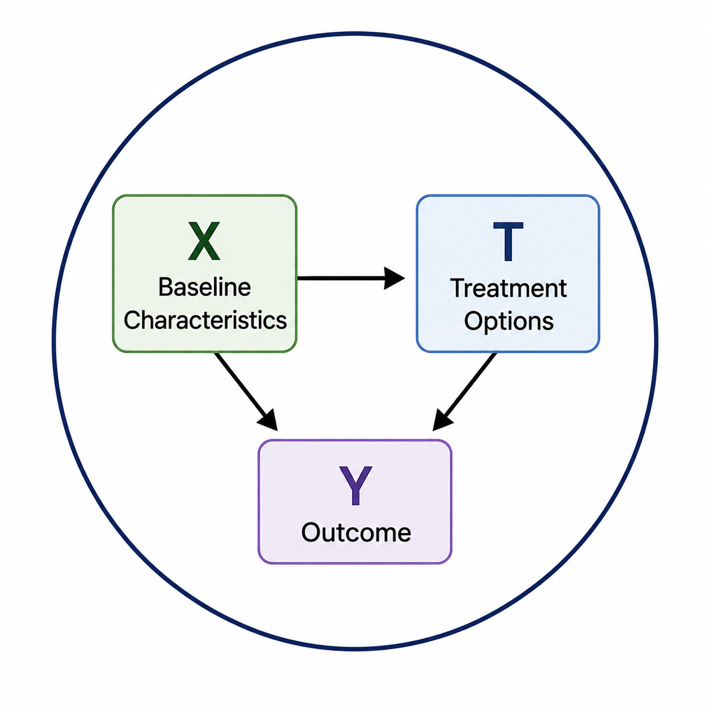
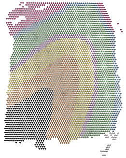
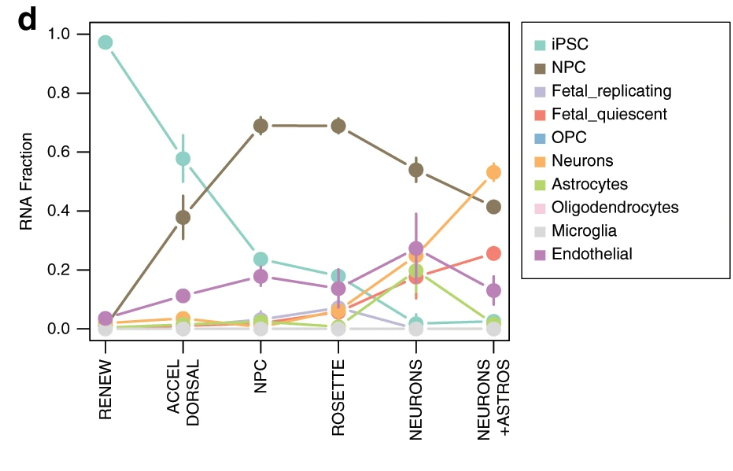
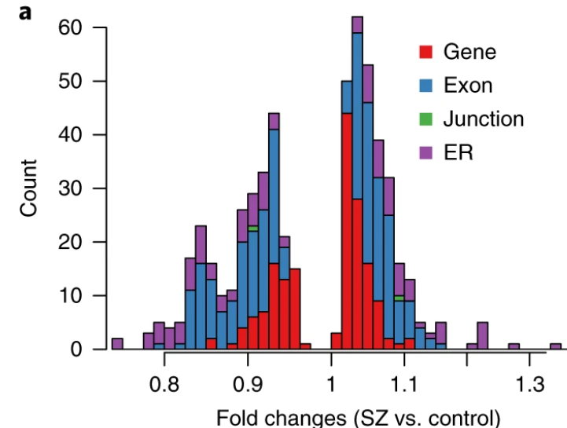
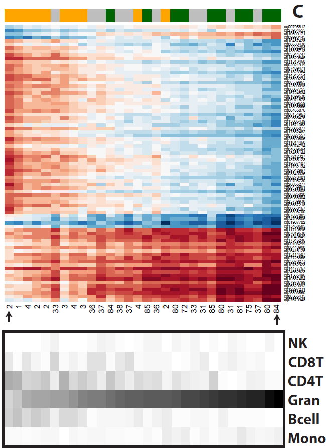
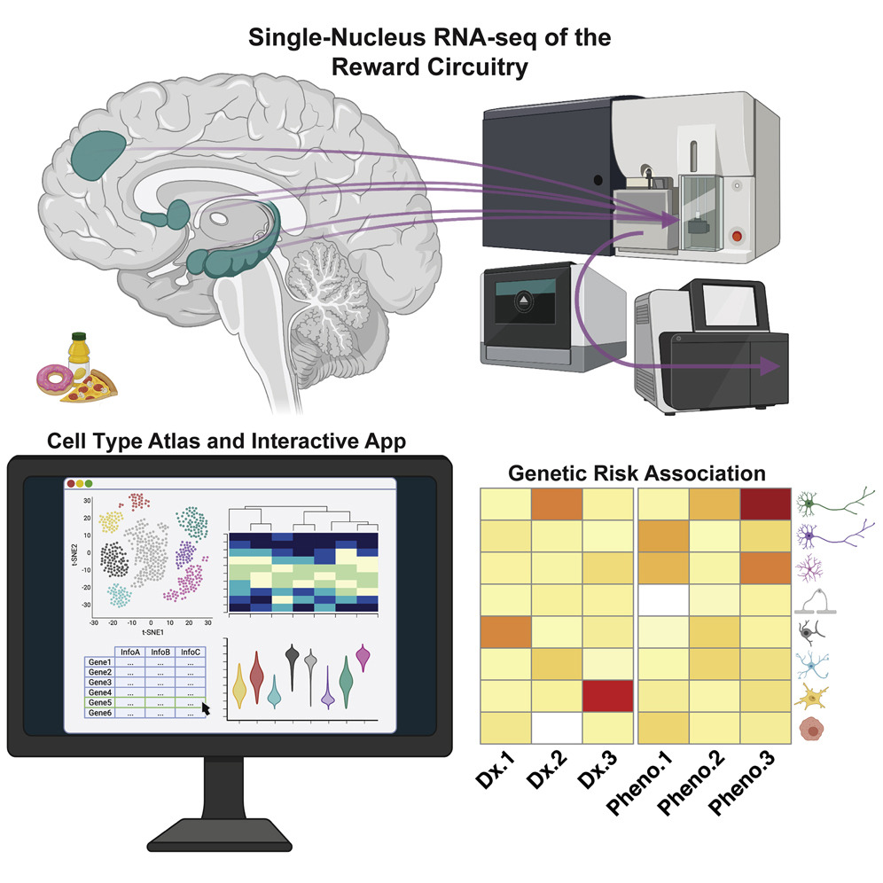

#### About

I'm a data science and computational biology executive with 15+ years of experience building and leading cross-functional data science, machine learning, and computational biology teams — most recently as VP, Head of Data Sciences at [Neumora Therapeutics](https://www.neumoratx.com). I translate between data science, life sciences, and clinical sciences to maximize the impact of drug discovery and development programs, from early target discovery through Phase 3 clinical trials.

I'm currently exploring new full-time leadership roles in biotech and pharma, and taking on a limited number of fractional and advisory engagements.

#### Consulting

<h5>Fractional / interim leadership</h5>

Embedded, part-time Head/VP of Data Science for biotech companies that need senior leadership without a full-time hire.

<h5>Hourly advisory</h5>

Strategy sessions and technical review on data science, computational biology, and team-building questions.

<h5>Project-based engagements</h5>

Scoped projects such as a data science org build-out plan, computational pipeline audit, or genomics data strategy.

<a class="aej-btn" href="https://calendly.com/andrewejaffe/30min">Book a 30-min call</a>

#### Expertise

Data science team leadership
AI/ML for clinical development
Computational biology & genomics
Clinical data science
AI/ML for drug discovery

#### Experience

<h5>VP, Head of Data Sciences — Neumora Therapeutics</h5>

2020–2026

Led a cross-functional data science, ML, and computational biology team spanning the full drug discovery/development pipeline, from target discovery through Phase 3 neuropsychiatric and neurodegenerative trials. Co-inventor on multiple clinical ML and therapeutic-use patents. Developed fit-for-purpose development strategies to enhance drug response and reduce placebo response using wide array of data modalities.

<h5>Group Leader, Data Science & Lead Investigator — Lieber Institute for Brain Development</h5>

2013–2020

Built and led a lab of 10+ scientists studying the genomics of brain development and severe mental illness. Principal Investigator on 10 NIH grants totaling $20M+. Published 145+ research articles (H-index 65).

<h5> Professor (Adjunct) — Johns Hopkins University</h5>

2013–Present

Departments of Psychiatry & Behavioral Sciences and Neuroscience 

#### Highlighted Projects

<h5>Causal machine learning to predict drug (or placebo) response</h5>

Developed and applied a causal modeling framework for reducing placebo response and increasing trial-level efficacy in neuropsychiatry clinical trials.

<a href="https://www.medrxiv.org/content/10.64898/2026.06.03.26354808v1.full-text">Preprint →</a>

<h5>Spatial transcriptomics of the human brain</h5>

Used spatial transcriptomics (10x Visium) to map layer-specific gene expression across the six layers of the human dorsolateral prefrontal cortex, linked laminar signatures to risk genes, and built an unsupervised clustering framework and public web app (spatialLIBD) for exploring the data.

<a href="https://www.nature.com/articles/s41593-020-00787-0">Paper →</a>

<h5>Modeling maturation and disease biology using iPSC-derived neurons</h5>

Developed computational tools to assess the maturity of iPSC-derived neurons using transcriptomics and electrophysiology, and identified deficits in schizophrenia.

<a href="https://www.nature.com/articles/s41467-019-14266-z">Paper 1 →</a>
<a href="https://www.pnas.org/doi/full/10.1073/pnas.2109395119">Paper 2 →</a>

<h5>Genotype-phenotype mapping in the human brain</h5>

Leveraged human postmortem brain tissue and cellular models to identify molecular mechanisms and signatures related to the causes and consequences of severe mental illness.

<a href="https://www.nature.com/articles/s41593-018-0197-y">Paper 1 →</a>
<a href="https://www.cell.com/neuron/fulltext/S0896-6273(19)30438-6">Paper 2 →</a>
<a href="https://www.nature.com/articles/s41593-020-0604-z">Paper 3 →</a>
<a href="https://www.nature.com/articles/nn.4181">Paper 4 →</a>

<h5>DNA methylation analyses of heterogeneous tissues</h5>

Developed statistical strategies and software for analyzing DNA methylation data from mixtures of cell types.

<a href="https://link.springer.com/article/10.1186/gb-2014-15-2-r31">Paper →</a>

<h5>Single-nucleus RNA sequencing of the human brain</h5>

Created a single-nucleus RNA-sequencing resource of 70,615 high-quality nuclei to generate a molecular taxonomy of cell types across five human brain regions that serve as key nodes of the human brain reward circuitry.

<a href="https://www.cell.com/neuron/fulltext/S0896-6273(21)00655-3">Paper →</a>

#### Publications

145+ peer-reviewed research articles, an H-index of 69, and recognition as a Highly Cited Researcher (top 1% of research, 2018) across computational biology, psychiatric genetics, and statistical methods development.  Full list on [Google Scholar](https://scholar.google.com/citations?user=SYXodmQAAAAJ&hl=en).

